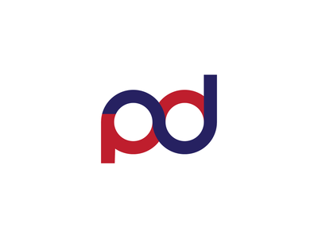

[![LinkedIn][linkedin-shield]][linkedin-url]

<!-- PYDEV logo -->
 

  

  <h3 align="center">pydev.tech</h3>

  

    Portfolio based Site
     
    Check <a href="http://pydev.tech/">pydev.tech</a>
    
  

## Technology Stack
Python(Django(DRF), Flask, Aiohttp)
OpenCV3+
HTML/CSS/JS

<!-- CONTACT -->
## Contact

[Ramazonov Baxodir](https://www.linkedin.com/in/bakhodir-ramazonov-b1255a1a9/) - boxa.developer@gmail.com

<!-- MARKDOWN LINKS & IMAGES -->
<!-- https://www.markdownguide.org/basic-syntax/#reference-style-links -->
[stars-shield]: https://img.shields.io/github/stars/othneildrew/Best-README-Template.svg?style=for-the-badge
[stars-url]: https://github.com/boxa-developer/pydev.tech/stargazers
[linkedin-shield]: https://img.shields.io/badge/-LinkedIn-black.svg?style=for-the-badge&logo=linkedin&colorB=555
[linkedin-url]: https://www.linkedin.com/in/bakhodir-ramazonov-b1255a1a9/
